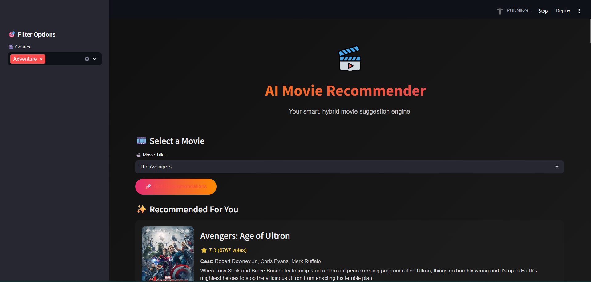
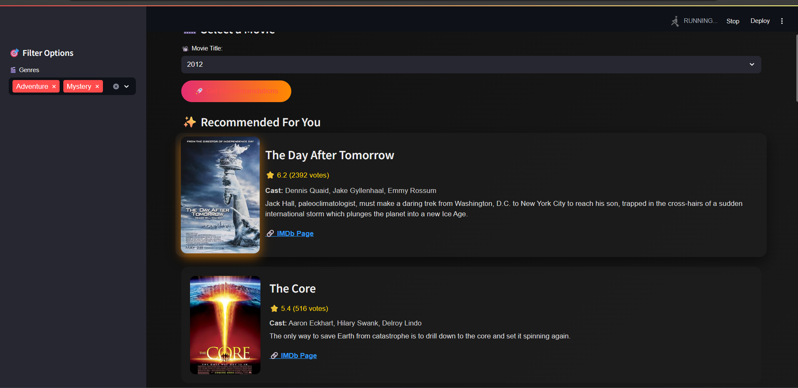

<!--
╔══════════════════════════════════════════════════════════╗
║           AI Movie Recommender 🎥 — README               ║
╚══════════════════════════════════════════════════════════╝
-->

# 🎥 AI Movie Recommender

[](https://www.python.org/)
[](https://streamlit.io/)
[](#)
[](#)
[](#)


> **A smart AI-powered movie recommender system** combining collaborative & content-based filtering. Elegant dark UI, OMDB integration, and genre filters included.

---


## 📸 Screenshots

| Home Page | Movie Cards |
|:---------:|:-----------:|
|  |  |

---

## 🔥 Features

- 🎯 **Hybrid Recommendation Engine**  
  Combines:
  - *Content-based filtering* (genres, cast, overview)
  - *Collaborative filtering* using KNN + Truncated SVD

- 🔗 **OMDB Integration**  
  Dynamically fetches posters, IMDb links, ratings & cast using OMDB API

- 🎛️ **Genre Filtering**  
  Sidebar filter to narrow down results based on genre(s)

- 🌌 **Dark Mode UI**  
  Custom CSS for an immersive experience

- 🔗 **Smart Query URLs**  
  Search state preserved via `?movie=` query parameters

---

## 🛠️ Tech Stack & Skills Used

| Layer                    | Technologies & Tools                                       |
|--------------------------|------------------------------------------------------------|
| **Frontend & UI**        | Streamlit, HTML/CSS, Dark theme CSS                        |
| **Recommendation Engine**| Scikit-learn: KNN, TruncatedSVD, cosine similarity         |
| **Data Handling**        | pandas, pickle, CSV                                        |
| **External APIs**        | OMDB API, requests                                         |
| **Deployment & DevOps**  | Git, GitHub, Streamlit CLI                                 |

---

## ⚙️ Installation & Setup

```bash
git clone https://github.com/aditya-rai-5/movie-recommender.git
cd movie-recommender
pip install -r requirements.txt
streamlit run app.py
